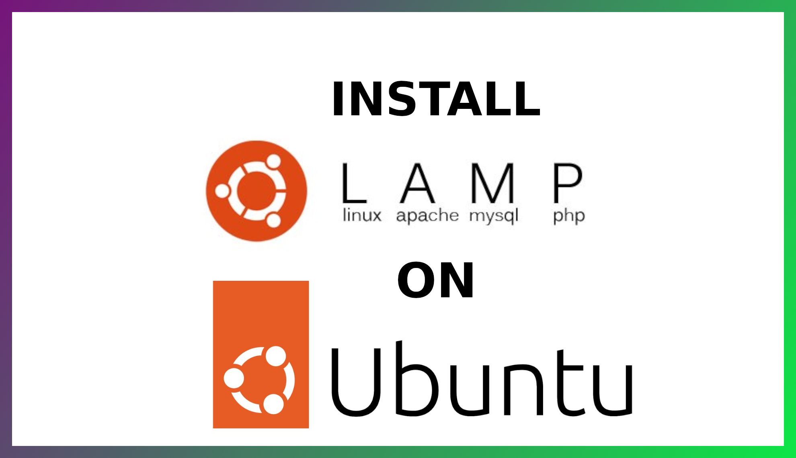
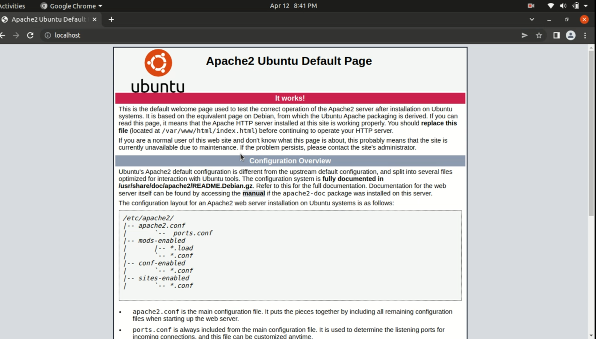
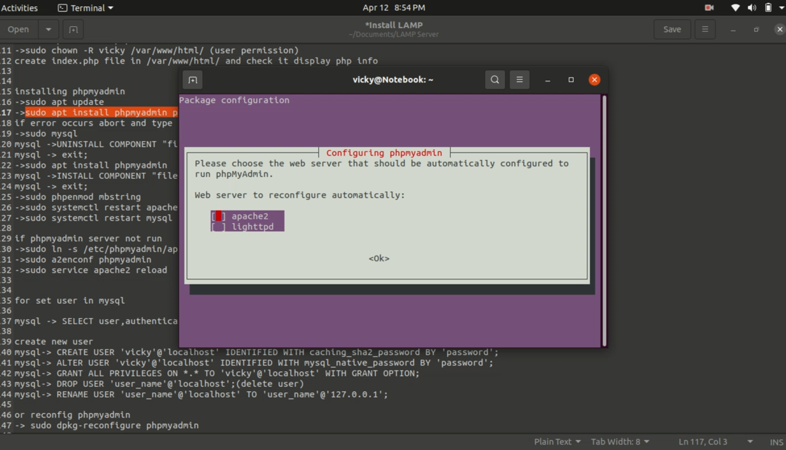
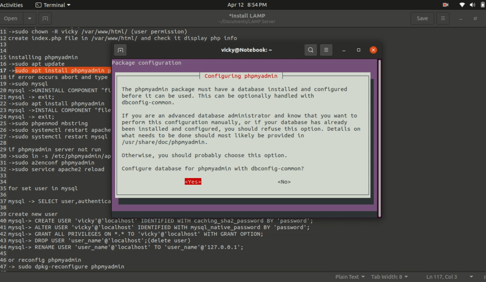
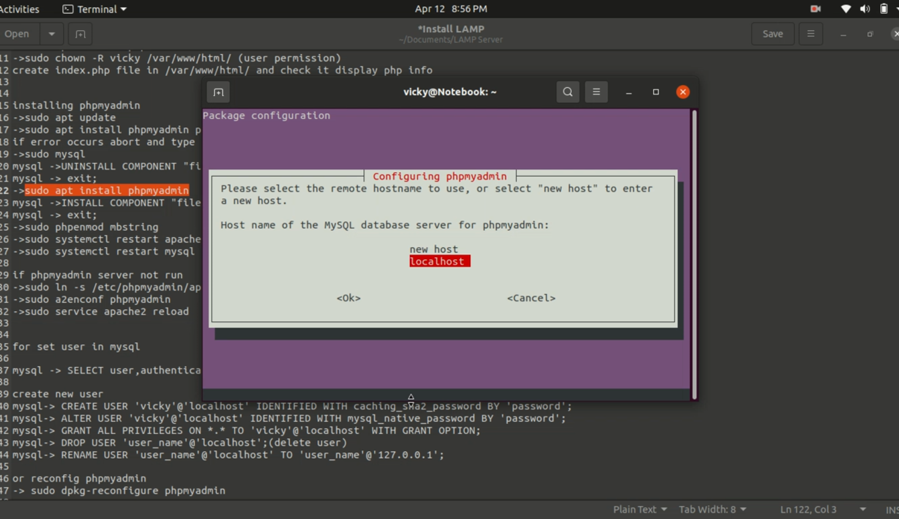
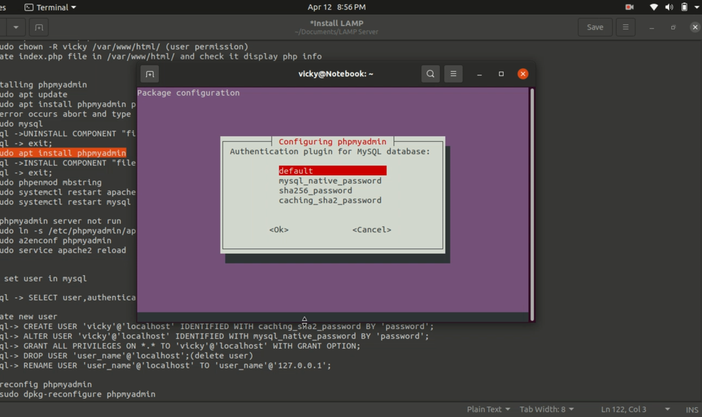
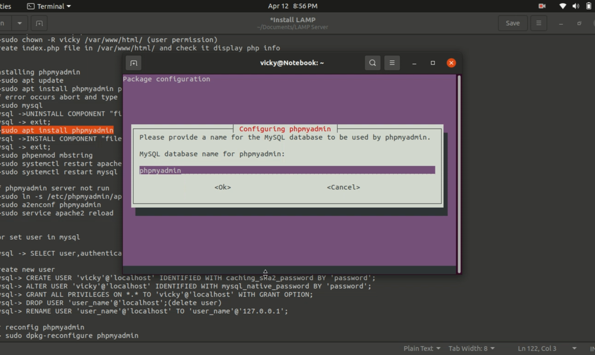
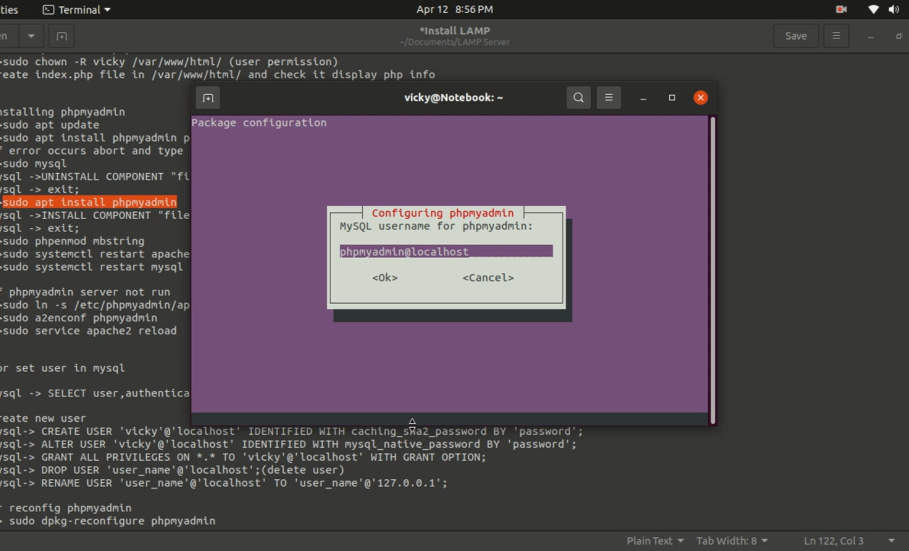
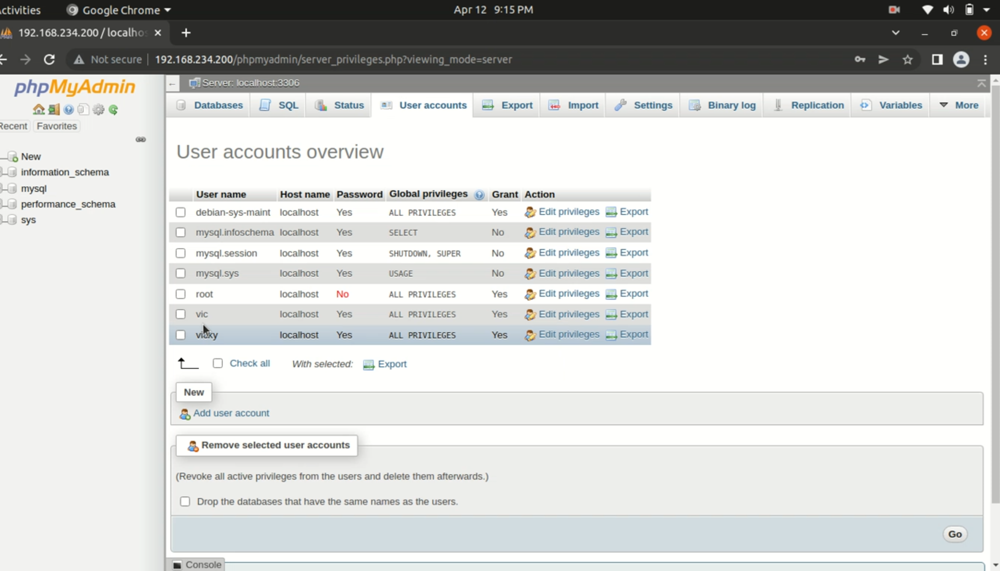

<!DOCTYPE html>
<html>
<head>
<meta http-equiv="Content-Type" content="text/html; charset=UTF-8">
<meta http-equiv="X-UA-Compatible" content="IE=edge">
<meta name="viewport" content="width=device-width,initial-scale=1">
<meta name="description" content="install LAMP in ubuntu 20.04 with phpmyadmin">
</head>
<body>

<h4>For YouTube link click on image</h4>        

<b>Introduction</b>

This is complete installation of LAMP included phpmyadmin to easily controller user in MySQL

LAMP means

L = Linux OS

A = Apache Server for local enviroment

M = MySQL to store user or other data related to domain

P = PHP to run php as backend programming language

<h3>Step 1 — Installing Apache</h3>
<ul>
<li>First, make sure cache is updated</li>
<li class="list_type">$sudo apt update && sudo apt upgrade </li>
<li>Use your root password to grant permission for sudo.</li>
<li>Install apache with:</li>
<li class="list_type">$sudo apt install apache2 </li>
<li>Check all apche2 application listed with:</li>
<li class="list_type">$sudo ufw app list </li>
<li>Output: (check below three application in list)
<ul>
    <li>Apache</li>
    <li>Apache Full</li>
    <li>Apache Secure</li>
</ul>
</li>
<li>If you want check which port is apache2 using run below command</li>
<li class="list_type">$sudo ufw app info "Apache Full" </li>
<li class="list_type">
<pre>
        
Output:
Profile: Apache Full
Title: Web Server (HTTP,HTTPS)
Description: Apache v2 is the next generation of the omnipresent Apache web
server.
Ports:
80,443/tcp
</pre>
</li>
<li>To check apache2 is correctly install use your public IP or type localhost in browser. Get IP by typing: </li>
<li class="list_type">$ifconfig </li>
<li>
    IP address look like: 192.168.200.210 etc first 6 digits are always same or just type <b>localhost</b> in browser
</li>

</ul>

<h3>Step 2 — Installing MySQL</h3>
<ul>
<li>MySQL is a database management system. Basically, it will organize and provide access to databases where your site can store information.</li>
<li>Use command to install MySQL:</li>
<li class="list_type">$sudo apt install mysql-server </li>
<li>After installing MySQL. Run a simple security script to lock down access to your database system. </li>
<li class="list_type">$sudo mysql_secure_installation </li>
<li class="list_type">

Output: (with Questions Answser)

<pre>
Securing the MySQL server deployment.

Connecting to MySQL using a blank password.

VALIDATE PASSWORD COMPONENT can be used to test passwords
and improve security. It checks the strength of password
and allows the users to set only those passwords which are
secure enough. Would you like to setup VALIDATE PASSWORD component?

Press y|Y for Yes, any other key for No: Y

There are three levels of password validation policy:

LOW    Length >= 8
MEDIUM Length >= 8, numeric, mixed case, and special characters
STRONG Length >= 8, numeric, mixed case, special characters and dictionary file

Please enter 0 = LOW, 1 = MEDIUM and 2 = STRONG: 1
Please set the password for root here.

New password: 

Re-enter new password: 

Estimated strength of the password: 50 
Do you wish to continue with the password provided?(Press y|Y for Yes, any other key for No) : Y
By default, a MySQL installation has an anonymous user,
allowing anyone to log into MySQL without having to have
a user account created for them. This is intended only for
testing, and to make the installation go a bit smoother.
You should remove them before moving into a production
environment.

Remove anonymous users? (Press y|Y for Yes, any other key for No) : Y
Success.

Normally, root should only be allowed to connect from
'localhost'. This ensures that someone cannot guess at
the root password from the network.

Disallow root login remotely? (Press y|Y for Yes, any other key for No) : Y
Success.

By default, MySQL comes with a database named 'test' that
anyone can access. This is also intended only for testing,
and should be removed before moving into a production
environment.

Remove test database and access to it? (Press y|Y for Yes, any other key for No) : Y
- Dropping test database...
Success.

- Removing privileges on test database...
Success.

Reloading the privilege tables will ensure that all changes
made so far will take effect immediately.

Reload privilege tables now? (Press y|Y for Yes, any other key for No) : Y
Success.

All done!
</pre>
</li>
<li>To check MySQL Server is install or not type:</li>
<li class="list_type">$sudo mysql </li>
<li>Use your root password to grant permission for sudo.</li>
</ul>
<h3>Step 3 — Installing PHP</h3>
<ul>
<li>You’ll need php-mysql, a PHP module that allows PHP to communicate with MySQL-based databases. You’ll also need libapache2-mod-php to enable Apache to handle PHP files.</li>
<li>To install php lastest version run:</li>
<li class="list_type">$sudo apt install php libapache2-mod-php php-mysql </li>
<li>Changing Apache’s Directory Index optional step</li>
<li class="list_type">$sudo nano /etc/apache2/mods-enabled/dir.conf </li>

<li class="list_type">Change file </li>
<li class="list_type">
<pre>
< IfModule mod_dir.c>
DirectoryIndex index.html index.cgi index.pl index.php index.xhtml index.htm
< IfModule>
</pre>
</li>
<li class="list_type">To</li>
<li class="list_type">
<pre>
< IfModule mod_dir.c>
DirectoryIndex index.php index.html index.cgi index.pl index.xhtml index.htm
< IfModule>
</pre>
</li>
<li>When you are finished, save and close the file by pressing CTRL+X. Confirm the save by typing Y and then hit ENTER to verify the file save location.</li>
<li>If you want php-cli , you could type:</li>
<li class="list_type">$sudo apt install php-cli </li>
<li>Now most important part is provide access to user who using var/www/html to read, write access using:</li>
<li class="list_type">$sudo chown -R vicky /var/www/html/ </li>
<li>Now delete default index.html file and create new file index.php in /var/www/html/ and type phpinfo();</li>
<li>Type on browser localhost or IP it will display php version and all active mode everything related to php</li>

</ul>
<h3>Step 4 — Installing phpmyadmin to handle databases easily</h3>
<ul>
<li>Run command:</li>
<li class="list_type">$sudo apt install phpmyadmin php-mbstring php-zip php-gd php-json php-curl </li>
<li>if error occurs during configuration phpmyadmin abort current error and type commands</li>
<li class="list_type">$sudo mysql </li>
<li>If ask password type your root password to access mysql</li>
<li>in mysql run following</li>
<li class="list_type">mysql>UNINSTALL COMPONENT "file://component_validate_password"; </li>
<li class="list_type">mysql>exit; </li>
<li class="list_type">$sudo apt install phpmyadmin </li>
<li>Config phpmyadmin then install component </li>

</li>
<li class="list_type">$sudo mysql </li>
<li>in mysql run following</li>
<li class="list_type">mysql>INSTALL COMPONENT "file://component_validate_password"; </li>
<li class="list_type">mysql>exit; </li>
<li class="list_type">$sudo phpenmod mbstring </li>
<li class="list_type">$sudo systemctl restart apache2 </li>
<li class="list_type">$sudo systemctl restart mysql </li>
<li>Type in browser localhost/phpmyadmin</li>
<li>if phpmyadmin not run use following command:</li>
<li class="list_type">$sudo ln -s /etc/phpmyadmin/apache.conf /etc/apache2/conf-available/phpmyadmin.conf </li>
<li class="list_type">$sudo a2enconf phpmyadmin </li>
<li class="list_type">$sudo service apache2 reload </li>
<li>Type in browser localhost/phpmyadmin</li>
<li>Now it ask for user and password</li>
</ul>
<h3>Step 5 — Creating user</h3>
<ul>
<li class="list_type">$sudo mysql </li>
<li>Use your root password to grant permission for sudo.</li>
<li class="list_type">mysql>CREATE USER 'user_name'@'localhost' IDENTIFIED WITH caching_sha2_password BY 'password'; </li>
<li>if some error display please check password policy is low, medium or strong using</li>
<li class="list_type">mysql>SHOW VARIABLES LIKE 'validate_password%'; </li>
<li>if you want to chnage this policy use:</li>
<li class="list_type">mysql>SET GLOBAL validate_password.policy=LOW; </li>
<li>alert user after creating user</li>
<li class="list_type">mysql>ALTER USER 'username'@'localhost' IDENTIFIED WITH mysql_native_password BY 'password'; </li>
<li>Grant permission to user</li>
<li class="list_type">mysql>GRANT ALL PRIVILEGES ON *.* TO 'username'@'localhost' WITH GRANT OPTION; </li>

<li>Check created user is in database using</li>
<li class="list_type">mysql>SELECT user,authentication_string,plugin,host FROM mysql.user; </li>
<li>Now, open localhost/phpmyadmin on browser type username and password that you created earlier.</li>
<li class="list_type">

</li>
</ul>

</body>
</html>
