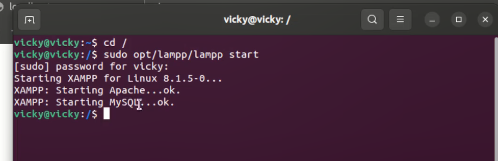
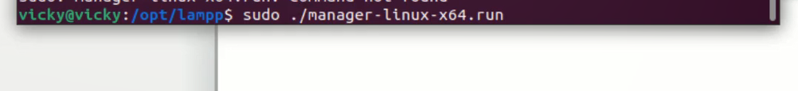

<!DOCTYPE html>
<html>
<head>
<meta http-equiv="Content-Type" content="text/html; charset=UTF-8">
<meta http-equiv="X-UA-Compatible" content="IE=edge">
<meta name="viewport" content="width=device-width,initial-scale=1">
<meta name="description" content="Launch XAMPP in ubuntu 22.04">
</head>
<body>

<h4>For YouTube link click on image</h4>        

<b>Introduction</b>

Hello friends, welcome to the world of rich PHP.

Today we are going to learn about how to launch the XAMPP server in ubuntu using four different ways.

Let's check whether any local server is running on the system or not. by just typing in browser localhost.

<h3>Step 1 — First methods to launch xampp control panel</h3>
<ul>
<li>Now, Open the terminal. In the terminal first, go to the root folder by typing</li>
<li class="list_type">$cd /</li>
<li>then type the command to start the XAMPP server:</li>
<li class="list_type">$sudo opt/lampp/lampp start</li>

<!-- image -->

    

<li>this will start a local server from the terminal.</li>
<li>Now check on the browser server is working or not. Type localhost it will display htdocs index.php file. Because I change the index.php file to ok.php that is why it shows all folders and files from the htdocs folder. </li>

<!-- image -->

  

<li>Now to stop the local server type command</li>
<li class="list_type">$sudo opt/lampp/lampp stop</li>

<!-- image -->

<li>it will stop the server</li>
<li>Check on a browser by reloading the current URL, whether the server stops working or not.</li>
</ul>

<h3>Step 2 — Second methods to launch xampp control panel</h3>
<ul>
<li>Now another method is also needed terminal to start server type.</li>
<li class="list_type">$sudo opt/lampp/xampp start</li>

<!-- image -->

<li>it is the same command but instead of last lampp we use the xampp keyword</li>
<li>and to stop the server use the same command</li>
<li class="list_type">$sudo opt/lampp/xampp stop</li>

<!-- image -->

<li>it will stop the server</li>
</ul>

<h3>Step 3 — Third methods to launch xampp control panel</h3>
<ul>
<li>In the third method, using the terminal we need to open the xampp control panel. Go to folder /opt/lampp to check where is .run file copy the file name with extension and in terminal type command to open the xampp control panel.</li>

<!-- image -->

<li class="list_type">$sudo ./manager-Linux-x64.run press enter it will open the control panel.</li>

<!-- image -->

<!-- image -->

<li>Click on the manage server tab and start the server from the control panel.</li>
</ul>

<h3>Step 4 — Fourth methods to launch xampp control panel</h3>
<ul>
<li>Now for the last method, we will create a desktop shortcut for the xampp control panel. For that go to the folder </li>
<li class="list_type">$cd /usr/share/applications and press enter</li>
<!-- image -->

<li>After this in the applications folder create xampp.desktop file.</li>
<li class="list_type">$sudo gedit xampp.desktop</li>
<li>copy-paste the code below code.</li>
<li>
<pre>
[Desktop Entry]
Encoding=UTF-8
Name=XAMPP Control Panel
Comment=Start and Stop XAMPP
Exec=sudo /opt/lampp/manager-linux-x64.run
Icon=/opt/lampp/htdocs/favicon.ico
Categories=Application
Type=Application
Terminal=true
</pre>
</li>

<li>Save and close the file after copy-pasted the code and check in the main menu xampp icon is displayed in that section click on the icon and type your password it will open the xampp control panel.</li>

<!-- image -->

<!-- image -->

</ul>

 Thank you guys see you next time

Like, share, and comment on the blog.

</body>
</html>