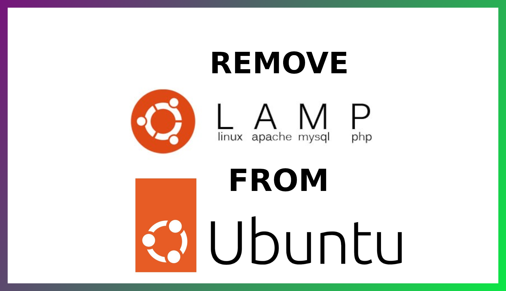

<!DOCTYPE html>
<html>
<head>
<meta charset="utf-8">
<meta name="viewport" content="width=device-width, initial-scale=1">
</head>
<body>

<h4>For YouTube link click on image</h4>        

<b>Introduction</b>

Remove LAMP From UBUNTU 20.04

LAMP means

L = Linux OS

A = Apache Server for local enviroment

M = MySQL to store user or other data related to domain

P = PHP to run php as backend programming language

<h3>Step 1 —  Remove PHPMyAdmin</h3>
<ul>
<li>First, make sure cache is updated</li>
<li class="list_type">$sudo apt update && sudo apt upgrade </li>
<li>Use your root password to grant permission to sudo.</li>
<li>We need to remove PHPMyAdmin package from ubuntu. Use the following command:</li>
<li class="list_type">$sudo dpkg -P phpmyadmin  </li>
<li>Once we remove the package, run the following command to remove the config file from apache and remove the folder from the system using:</li>
<li class="list_type">$sudo rm -vf /etc/apache2/conf.d/phpmyadmin.conf </li>
<li class="list_type">$sudo rm -vfR /usr/share/phpmyadmin </li>
<li>After removing the folder, Please check if it is completely removed from the system or not. Just run the following command:</li>
<li class="list_type">$sudo apt autoremove phpmyadmin </li>
<li>After all the above commands. Check that PHPMyAdmin on browser by typing <b>loalhost/phpmyadin OR your public IP address/phpmyadmin e.g. 192.168.2.5/phpmyadmin</b></li>
</ul>

<h3>Step 2 — Remove Apache2</h3>
<ul>
<li>First, You need to stop apache2 to make sure no error occurs during removing the package from the system:</li>
<li class="list_type">$sudo service apache2 stop </li>
<li>After stoped apache2 service run the following commands to remove the package from the system:</li>
<li class="list_type">$sudo apt-get purge apache2 apache2-utils apache2.2-bin  </li>

<li class="list_type">$sudo apt remove apache2.* </li>

<li class="list_type">$sudo apt-get autoremove </li>
<li>Once all packages are clean we need to check where is apache2 folder in the system and remove that folder from the system:</li>
<li class="list_type">$whereis apache2 </li>
<li class="list_type">$sudo rm -rf /etc/apache2 </li>
<li>To check apache2 completely remove it from the ubuntu run the following command:</li>
<li class="list_type">$sudo systemctl status apache2</li>
<li>Or just type apache2 in terminal</li>
</ul>

<h3>Step 3 — Remove PHP</h3>
<ul>
<li>Now you are almost there to remove PHP from the ubuntu. First, check which PHP version is installed in your system:</li>
<li class="list_type">$php -v</li>
<li>If multiple PHP versions are installed in the system. Remove one by one using the following commands::</li>
<li class="list_type">$sudo apt-get purge `dpkg -l | grep php7.4| awk '{print $2}' |tr "\n" " "`</li>
<li class="list_type">$sudo apt-get purge php7.*</li>
<li class="list_type">$sudo apt-get autoremove --purge</li>
<li>Once all packages are clean we need to check where is PHP folder in the system and remove that folder from the system:</li>
<li class="list_type">$whereis php</li>
<li class="list_type">$sudo rm -rf /etc/php</li>
<li>To make sure PHP is removed from the system run the following command:</li>
<li class="list_type">$php</li>

</ul>
<h3>Step 4 — Remove MySQL</h3>
<ul>
<li>One last step is to remove LAMP. First, You need to stop MySQL to make sure no error occurs during removing the package from the system: </li>
<li class="list_type">$sudo service mysql stop</li>
<li>After stoped MySQL service run the following commands to remove the package from the system:</li>
<li class="list_type">$sudo apt-get remove --purge *mysql\*</li>
<li class="list_type">$sudo apt-get remove --purge mysql-server mysql-client mysql-common -y</li>
<li>Once all packages are clean we need to check where is mysql folder in the system and remove that folder from the system:</li>
<li class="list_type">$whereis mysql</li>
<li class="list_type">$sudo rm -rf /etc/mysql</li>
<li>To check mysql completely remove it from the ubuntu run the following command:</li>
<li class="list_type">$sudo systemctl status mysql</li>
<li>Or just type mysql in terminal</li>
</ul>

<h3>Step 5 - Check everything is clean</h3>
<ul>
<li>Run the following commands:</li>
<li class="list_type">$sudo apt-get autoremove</li>
<li class="list_type">$sudo apt-get autoclean</li>
<li>Reboot the system</li>
<li class="list_type">$sudo reboot</li>
</ul>

</body>
</html>
