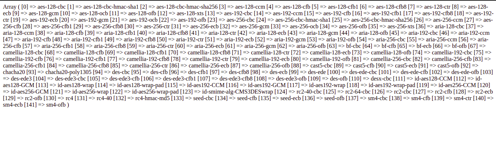
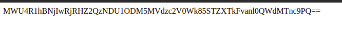

<!DOCTYPE html>
<html>
<head>
<meta http-equiv="Content-Type" content="text/html; charset=UTF-8">
<meta http-equiv="X-UA-Compatible" content="IE=edge">
<meta name="viewport" content="width=device-width,initial-scale=1">
<meta name="description" content="Strong Encryption and Decryption Methods in PHP">
</head>
<body>

	

<b>Introduction</b>

Hello Coders, Welcome everyone to today’s blog.

So, today we are going to learn about generating random powerful encryption string using openssl_encrypt() function and openssl_decrypt() function.

let's begin with coding. 

<h4>Step 1: Create class and static variables</h4>
<ul>
<li>Now we need a random 16-character long string for the initialization vector.</li>
<li>First, I'm creating one class to define methods in it.</li>
 
<pre class="prettyprint">
class secure
</pre>
<li>After defining the class create one private variable and put any characters in it using the straight-line symbol to later differentiate those characters:</li>
<li>Here im using the small letter, capital letters, and numbers for character</li>
<li>Create like</li>
 
<pre class="prettyprint">
private static $chars = abcdefghijoprstuxyz|ABCDEFGHIJKOPRSTUVYZ|0123456789;
</pre>                    
</ul>

<h4>Step 2: Create randomString() function</h4>
<ul>
<li>Now, create one static function randomString(), and In that function define the length we want for the initialization vector that is 16 characters long.</li>
<li>use explode() function to break a string into an array.</li>
 
<pre class="prettyprint">
$sets = explode("|", self::$char);
</pre>
<li>Use foreach() loop to loop through array that we created using explode() function.</li>
<li>Before using the loop define two empty variables $all and $random for later use.</li>
<li>Now in foreach() use concatenation operator to connects the same variable's multiple strings to output a single long string.</li>
 
<pre class="prettyprint">
foreach($sets as $set){
$all .= $set;
}
</pre>
<li>after assigning one single string to $all variables. Use the same variable and create each string word as an array using the str_split() function to use it in for loop.</li>
<li>Now in for loop define how many length long strings we need, we already pass the $length variable so use that variable in for loop.</li> 
<li>Now in for loop use last $random variable to generate output and get all loop word in $random variable use concatenation operator( .=):</li>
 
<pre class="prettyprint">
for($i = 0; $i < $length; $i++){
$random .= $all[array_rand($all)];
}
</pre> 
<li>array_rand() function is used to get a random array key so we can get any random value.</li>
<li>return random variable to see if the output is correct or is their array in it.</li> 
<li>To call the static function we do not need to create a class object we can call a method like class_name::functionname</li>
 
<pre class="prettyprint">
private static function randomString($length = 16){
$sets = explode("|", self::$chars);
$all = "";
$random = "";
foreach($sets as $set){
$all .= $set;
}

$all = str_split($all);

for($i = 0; $i < $length; $i++){

$random .= $all[array_rand($all)];
}
return $random;
}
</pre>
 
<pre class="prettyprint">
echo secure::randomString();
</pre>
<li>check on the browser if it is working or not to check string length is correct use the function strlen() function. In the randomString() function you can pass any number to the function to generate any number of strings. Now make the randomString function a private function because we are not using that function outside class.</li>

</ul>

<h4>Step 3: Define all static variable</h4>
<ul>
<li>After generating a random string define a private static variable for ciphering methods. im using <b>aes-256-cbc-hmac-sha256</b> this one means what type of encryption method we are using it.</li>
 
<pre class="prettyprint">
private static $cipher = "aes-256-cbc-hmac-sha256";
</pre>  
<li>Use openssl_get_cipher_methods() to get all available methods there are a total of 141 methods you can select any one from them.</li>
<pre class="prettyprint">
print_r(openssl_get_cipher_methods());
</pre>
 
<!-- Image -->

<li>Now define another variable $option = 0 this variable is a integer variable. it holds the flags OPENSSL_RAW_DATA and OPENSSL_ZERO_PADDING.</li>
 
<pre class="prettyprint">
private static $option = 0;
</pre> 
<li>The last static variable we need is the $key which we use to encrypt and decrypt data. You can use any key </li>
 
<pre class="prettyprint">
private static $key = "any secrete key";
</pre>  
</ul>

<h4>Step 4: Create function for encrypt string</h4>
<ul>
<li>Now create a function for encrypting data. Define one static variable and to that variable pass openssl_encrypt value</li>
<li>openssl_encrypt() function needs $data, the ciphering method we already define use that using self::$cipher</li>
<li>next parameter we need to pass $key </li>
<li>after $key we need to pass option integer value which we define as zero.</li>
<li>and the last parameter we need is the initialization vector.</li>
<li>For IV define one variable and in that variable call randomString() function and pass that variable to openssl_encrypt() function.</li>
<li>Now we need to return the value we can more secure that string by just returning using the base64_encode() function first pass $iv and get any 6 or any characters in between iv and the encrypted string in base64_encode() function.</li>
<li>You can also define your own security but always send an initialization vector. Later we need an initialization vector to decrypt data.</li>
<li>Now call encrypt function by typing </li>
 
<pre class="prettyprint">
public static function encrypt($data){
static $encrypt;

$iv = self::randomString();

$encrypt = openssl_encrypt($data, self::$cipher, self::$key, self::$option, $iv);

return base64_encode($iv . mt_rand(100000, 999999) . $encrypt);
} 
</pre>
 
<pre class="prettyprint">
echo secure::encrypt("Hello Rich PHP");
</pre>
<li>Check on the browser string is encrypted or not. As you see some encrypt string is displayed on the browser.</li>
 
<!-- image -->

</ul>

<h4>Step 4: Create function to decrypt data</h4>
<ul>
<li>Now we need to write a function to decrypt data. Remember how you encrypt data in encrypt function in this method we need to break that encrypt string to decrypt the data.</li>
<li>Encrypted strings first 22 characters that we add in encrypt function we need to remove that characters by using the substr() function.</li>
<li>The substr() function returns a part of a string. The substr() function needs 3 parameter strings, where to start, and the length of the string. The last parameter is optional.</li>
<li>use substr() function by just passing string and 22 to function it will give you encrypt string that we need. Before passing a string do not forget to use base64_decode() function to decode the string. In data_enc we get encrypt a string.</li>
 
<pre class="prettyprint">
$data_enc = substr(base64_decode($data), 22);
</pre>                      
<li>Now we need the first 16 digits for the initialization vector.</li>
<li>For that use, the same function to get iv from a string use the function substr() pass base64_decode data to function then where to start, from 0 in our case. after length that we need.</li>
 
<pre class="prettyprint">
substr(base64_dedecode($daat), 0, 16);
</pre>
<li>now we have everything we need to call function openssl_decrypt() first pass $data_enc then pass ciphering method then pass $key and $ options parameter last we need to pass the initialization vector.</li>
<li>return $decrypt variable</li>
<li>check function is working correctly or not. call function</li>
 
<pre class="prettyprint">
public static function decrypt($data){
static $decrypt;

$data_enc = substr(base64_decode($data), 22);

$iv = substr(base64_decode($data), 0, 16);

$decrypt = openssl_decrypt($data_enc, self::$cipher, self::$key, self::$option, $iv);

return $decrypt;
}
</pre>
 
<pre class="prettyprint">
echo secure::decrypt("pass encrypt string");
</pre>
 
<pre class="prettyprint">
echo secure::encrypt("Hello Rich PHP") . " ";

echo secure::decrypt(secure::encrypt("Hello Rich PHP YOUTUBE"));
</pre>
<li>As you see on the browser it generates a random encrypted string and easily decrypts data please do use it in your project.</li>
 
<!-- images -->
</ul>
<h4>Complete code</h4>
<pre class="prettyprint">
class secure{

private static $chars = "abcdefghyxz|ABCDEFGRTHSXYZ|0123456789";

private static $cipher = "aes-256-cbc-hmac-sha256"; //aes-256-cbc-hmac-sha256

private static $option = 0;

private static $key = "any secrete key";

private static function randomString($length = 16){
$sets = explode("|", self::$chars);
$all = "";
$random = "";
foreach($sets as $set){
$all .= $set;
}

$all = str_split($all);

for($i = 0; $i < $length; $i++){

$random .= $all[array_rand($all)];
}

return $random;

}

public static function encrypt($data){
static $encrypt;

$iv = self::randomString();

$encrypt = openssl_encrypt($data, self::$cipher, self::$key, self::$option, $iv);

return base64_encode($iv . mt_rand(100000, 999999) . $encrypt);
} 

public static function decrypt($data){
static $decrypt;

$data_enc = substr(base64_decode($data), 22);

$iv = substr(base64_decode($data), 0, 16);

$decrypt = openssl_decrypt($data_enc, self::$cipher, self::$key, self::$option, $iv);

return $decrypt;
}

}

echo secure::encrypt("Hello Rich PHP") . " ";

echo secure::decrypt(secure::encrypt("Hello Rich PHP YOUTUBE"));

</pre>

<h4>like comment and share for more blogs.</h4> 
<h4>Thank you guys see you in the next blog bye bye</h4>  

    
</body>
</html>
