<!DOCTYPE html>
<html>
<head>
<meta http-equiv="Content-Type" content="text/html; charset=UTF-8">
<meta http-equiv="X-UA-Compatible" content="IE=edge">
<meta name="viewport" content="width=device-width,initial-scale=1">
<meta name="description" content="install XAMPP in ubuntu 22.04 with phpmyadmin">
</head>
<body>

<h4>For YouTube link click on image</h4>        

<b>Introduction</b>

Hello friend, hope all of you doing good, and welcome to the world of rich PHP.

In this blog, we are going to learn about how to install xampp on ubuntu.

<h3>Step 1 — Download XAMPP .run file</h3>

On google search xampp. you will see a download link click on that link. and select the Linux PHP version you want to download the ".run" file. As you see I have already downloaded the file. so let's begin to installation.

<h3>Step 2 — Execute XAMPP .run file</h3>
<ul>
<li class="list_type">In the terminal locate where is downloaded file is and permit that file to execute that file in ubuntu. with command:</li>
<li class="list_type">$sudo chmod 775 xampp-linux-x64-8.1.5-0-installer.run</li>

<a href="images/1.png" >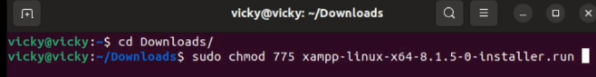</a>

<li class="list_type">After given permission,  execute that file using the command</li>
<li class="list_type">$sudo ./xampp-linux-x64-8.1.5-0-installer.run</li>

<a href="images/2.png" >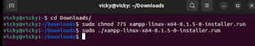</a>

<li class="list_type">wait for to start xampp execution.</li>
<li class="list_type">It will take some time to execute wait till it completes its processing</li>
</ul>

<h3>Step 3 — Install XAMPP</h3>
<li class="list_type">Remember that xampp stores its file in /opt/lampp. Here is the simple interface for xampp.</li>

<a href="images/3.png">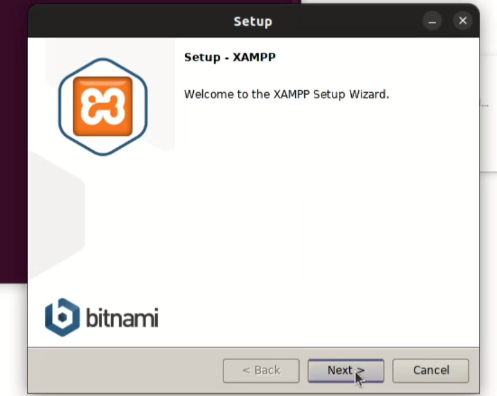</a>

<a href="images/4.png">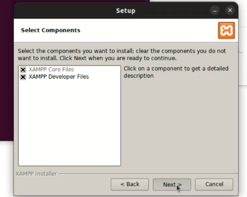</a>

<a href="images/5.png">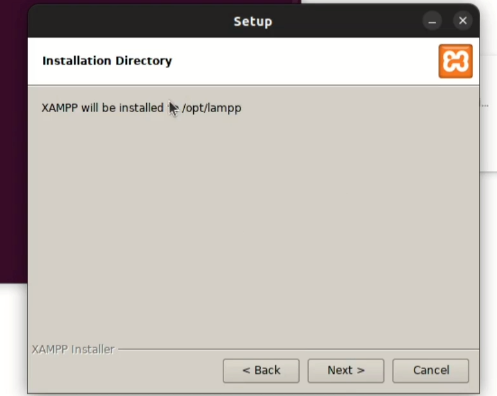</a>

<a href="images/6.png">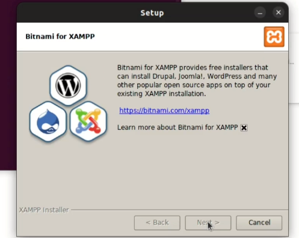</a>

<a href="images/7.png">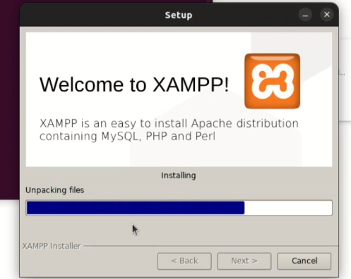</a>

<li class="list_type">start apache and MySQL server from the xampp control panel</li>

<a href="images/8.png">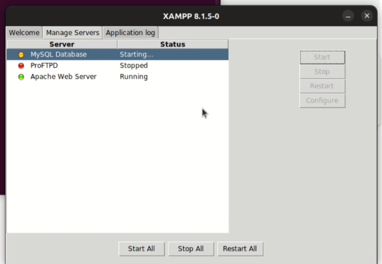</a>

<li class="list_type">Check on a browser by typing localhost and for PHPMyAdmin type localhost/PHPMyAdmin</li>

<a href="images/9.png">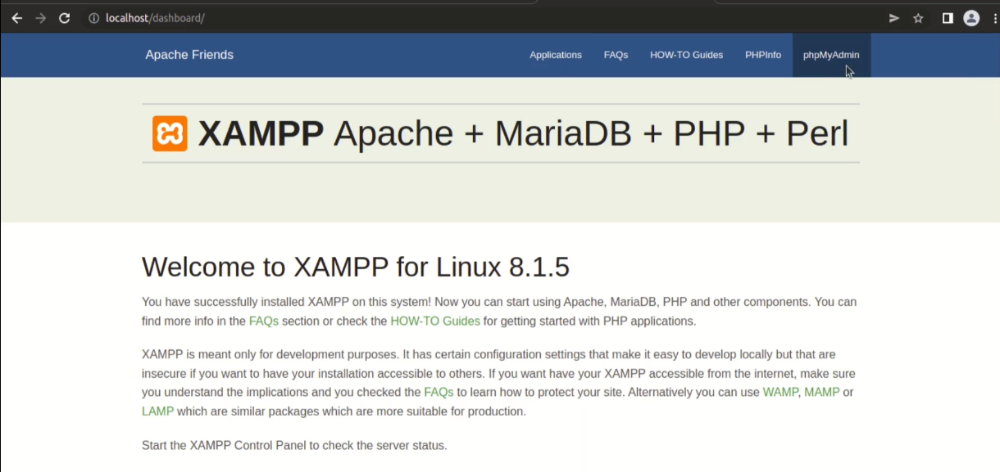</a>

<a href="images/10.png">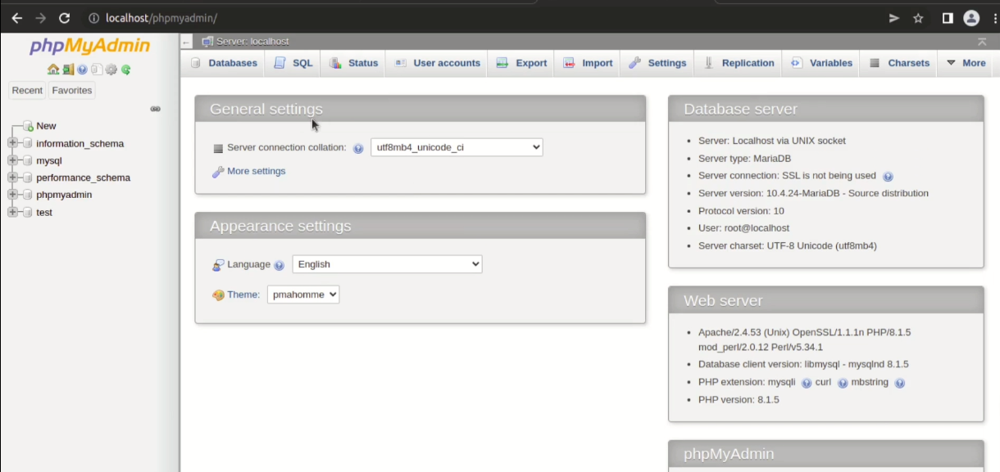</a>

<h3>Step 4 — Permission to htdocs folder</h3>
<ul>
<li class="list_type">Now the important thing is that provide the needed permission to the htdocs folder for the user.</li>
<li class="list_type">For that go to /opt/lampp folder to permit the htdocs folder. we need to write a command:</li>
<li class="list_type">$sudo chown -R vicky htdocs/</li>

<a href="images/11.png">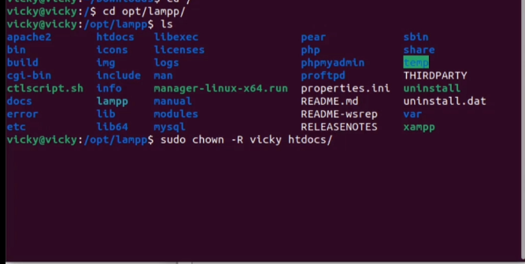</a>

<li class="list_type">here we permit the user vicky to read, write and delete files.</li>
</ul>

<h3>Step 5 - Check permission for folder</h3>
<ul>
<li class="list_type">Now open the editor I'm using sublime editor</li>

<a href="images/12.png">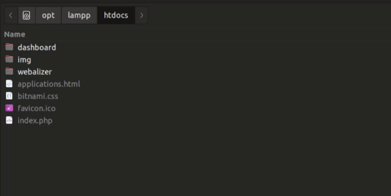</a>

<li class="list_type">Edit any file or current index file to check given permission working or not. In the current index file check PHP all info and version by typing the phpinfo() function.</li>

<a href="images/13.png">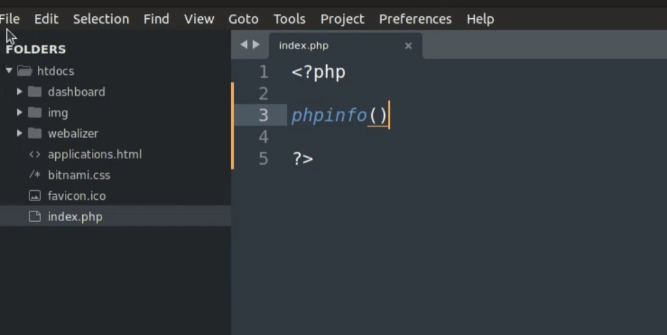</a>

<li class="list_type">Run localhost URL on browser and check if it is working or not. </li>

<a href="images/14.png">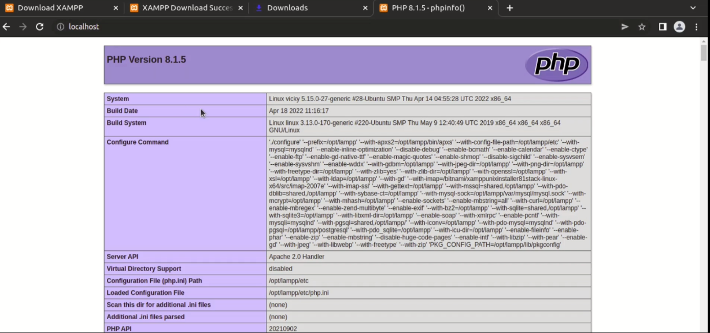</a>

</ul>

That's it, guys. Finally done. you are successfully installed xampp on ubuntu.

 thank you, guys. Please keep supporting. 

Like, share, and comment on the blog.

</body>
</html>