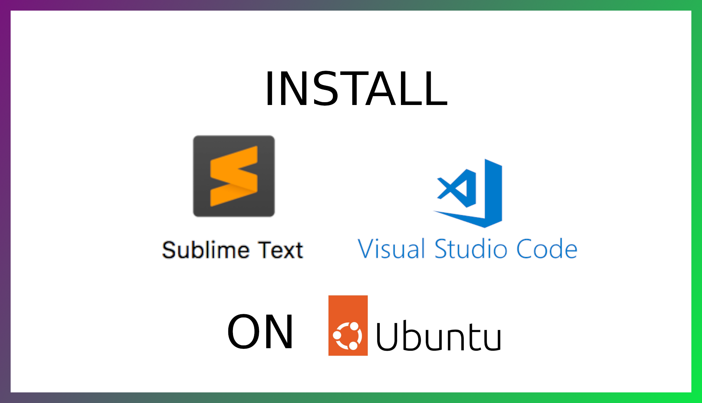

<!DOCTYPE html>
<html>
<head>
<meta http-equiv="Content-Type" content="text/html; charset=UTF-8">
<meta http-equiv="X-UA-Compatible" content="IE=edge">
<meta name="viewport" content="width=device-width,initial-scale=1">
<meta name="description" content="install sublime text 4 or VS Code">
</head>
<body>

<h4>For YouTube link click on image</h4>        

<b>Introduction</b>

Selecting an editor for coding is also important. Best editors always help to write better, clean, and understandable code.

In this blog, we install the two best editors <b>Sublime text 4</b> and <b>VS Code</b> for PHP.

First Install sublime and its useful plugin for PHP, CSS, and JS.

Sublime Text 4 is a lightweight editor for Backend and UI development. Included more than 20+ programming language support by sublime text 4 and 1000+ more plugins to make it an even more great editor for the developer.

<h3>Step 1 — Install using commands</h3>
<ul>
<li>Check update for  ubuntu:</li>
<li class="list_type">$sudo apt update && sudo apt upgrade </li>
<li>Use your root password to grant permission for sudo.</li>
<li>Install the GPG key:</li>
<li class="list_type">$wget -qO - https://download.sublimetext.com/sublimehq-pub.gpg | sudo apt-key add - </li>
<li>Ensure apt is set up to work with https sources:</li>
<li class="list_type">$sudo apt-get install apt-transport-https </li>

<li>Select package stable or development package in this we select stable: </li>
<li class="list_type">$echo "deb https://download.sublimetext.com/ apt/dev/" | sudo tee /etc/apt/sources.list.d/sublime-text.list </li>

<li>Install Sublime Text: </li>
<li class="list_type">$sudo apt update </li>
<li class="list_type">$sudo apt install sublime-text </li>
</ul>

<h3>Or install using Ubuntu software</h3>
<ul>
<li>Search for sublime text click on install</li>
</ul>
<h3>Or download the .deb file and install it in Ubuntu</h3>

<h3>Step 2 - The most important part is to install the plugin for PHP, CSS, and JS</h3>
<ul>
<li>In sublime text first install the package controller for sublime text: </li>
<li class="list_type">click -> tools -> command palette -> search package -> click install package control </li>

<li>Install LSP and LSP - intelephense: </li>
<li class="list_type">click -> tools -> command palette -> search package -> click package control: Install Package -> Search LSP (click) </li>
<li class="list_type">click -> tools -> command palette -> search package -> click package control: Install Package -> Search LSP - intelephense(click) </li>
<li>Also pop-up for nodejs package install nodejs package</li>
<li>Install SublimeLinter</li>
<li class="list_type">click -> tools -> command palette -> search package -> click package control: Install Package -> Search SublimeLinter </li>
<li>also in similar format install SublimeLinter sub-package </li>
<li class="list_type">SublimeLinter-php </li>
<li class="list_type">SublimeLinter-csslint </li>
<li class="list_type">SublimeLinter-jshint </li>

<h3>Now, Install VS Code</h3>
<li>VS Code is also a good editor you can say most popular editor for almost every programming language. The only draw needs a good config pc. </li>
<li>Go to the official website download the .deb file install using the installer.</li>
<li>For vs code already it is perfect for CSS and js you need to install only one plugin in vs code for PHP which helps a lot.</li>
<li>Click on extension or press ctrl+shift+x to search for PHP-intelephense to install this package.</li>
</ul>

if you ask me my personal choice is a sublime text it is lightweight, fast, and old style, a good editor.

Both editors are best to use but for vs code pc config needs to be a little high on another hand sublime text is lightweight and can run on old PC also.

</body>
</html>