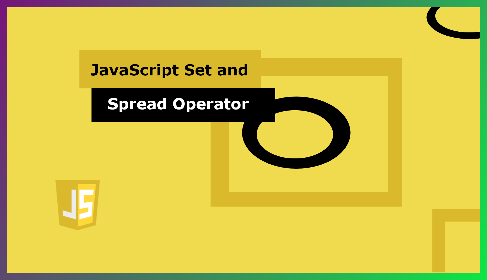

<!DOCTYPE html>
<html>
<head>
<meta http-equiv="Content-Type" content="text/html; charset=UTF-8">
<meta http-equiv="X-UA-Compatible" content="IE=edge">
<meta name="viewport" content="width=device-width,initial-scale=1">
<meta name="description" content="Use of JavaScript Set and spread operator">
</head>
<body>

<b>Introduction</b>

Hello Developer, Welcome to my first javascript blog about JavaScript set and spread operator. In most tutorials, no one tells you about this. 

<h4>Use of JavaScript sets</h4>
<ul>
<li>So, let's begin with a JavaScript set</li>
<li>In JavaScript Set is a collection of unique values. A Set can hold any value of any data type.</li>
<li>Consider if we have one array with a duplicate value in it but we want a unique value from the array() that time we can easily get a unique value from the array using a JavaScript set.</li>
 
<pre class="prettyprint">
<code class="language-javascript">
const array = [1, 2, 1, 2, 3, 4, 5, 6, 7, 6, 7, 8, 9];
console.log(new Set(array)); 
//Output
Set(8) [ 1, 2, 3, 4, 5, 7, 8, 9 ]
</code>
</pre>
<li>Or even if an array contains duplicate strings in it. JavaScript set can easily create a new array with a unique string</li>
 
<pre class="prettyprint">
<code class="language-javascript">
const array = ["rich", "rich", "PHP", "PHP"];
console.log(new Set(array)); 
//OUTPUT
Set [ "rich", "PHP" ]
</code>
</pre>
<li>JavaScript Set has some properties also. In this video, we are not going to check all properties but some useful properties like:</li>
<li>
<b>var.size – </b> We want count of set that time we can use size properties to get count of set.
</li>
 
<pre class="prettyprint">
<code class="language-javascript">
const array = ["rich", "rich", "PHP", "PHP"];
const sets =  new Set(array)
console.log(sets.size); 
//OUTPUT
2
</code>
</pre>
<li>Here set has only two vaues in it.</li>
<li>
<b>var.add() – </b>
To add value in set we can use add() properties it add value at the end of set.
</li>
 
<pre class="prettyprint">
<code class="language-javascript">
const array = ["rich", "rich", "PHP", "PHP"];
const sets =  new Set(array)
sets.add("Like").add("Comment").add("Share")
console.log(sets);
//OUTPUT
Set(5) [ "rich", "PHP", "Like", "Comment", "Share" ]  
</code>
</pre>

<li>
<b>var.delete() -</b>
To delete value from set we need to mention value in delete() function.
</li>
 
<pre class="prettyprint">
<code class="language-javascript">
const array = ["rich", "rich", "PHP", "PHP"];
const sets =  new Set(array);
sets.delete("PHP");
console.log(sets);
//OUTPUT
Set [ "rich" ] 
</code>
</pre>
<li>
In the delete() function you can delete one element at a time from a set.
If you use multiple delete() function like add() function it throw exception.
So be careful when you are using the delete() function.
</li>                 
</ul>

<h4>Other set properties are</h4>
<ol>
<li><b>var.clear() - </b>To Clear all set element we use clear() function.</li>
<li><b>var.entries() – </b>It returns an iterator object which contains an array having the entries of the set, in the insertion order.</li>
<li><b>var.has() - </b>it check set contain specified element or not.It returns true if it has value in it.</li>
<li><b>var.values() – </b>It returns all the values from the Set in the same insertion order. </li>
<li><b>var.keys() – </b>It also returns all the values from the Set in the insertion order. </li>
<li><b>var.forEach() – </b>It executes the given function once for every element in the Set, in the insertion order.</li>
<li><b>subSet() – </b>It returns true if Set A is a subset of Set B.</li>
<li><b>union() – </b>It returns a set that consists of a union of Set A and Set B.</li>
<li><b>intersection() – </b>It returns the intersection of Set A and Set B.</li>
<li><b>difference() – </b>It returns the Set which contains the difference between Set A and Set B.</li>
</ol>

<h4>Use of Spread Operator</h4>
<ul>
<li>Now, we are going to check the spread operator in JavaScript. The spread operator is a new addition to the features available in the JavaScript ES6 version. The spread operator is used to expand or spread an iterable or an array.</li>
<li>In JavaScript spread operator, are defined <b>using three dots (...)</b></li>
<li>Consider if we have two arrays and from that two arrays we need unique values and also other values that are not common in these two arrays.</li>
<li>First, we need to combine these two arrays, To combine two arrays we can use the spread operator. From two different arrays, we can easily create one array and find out unique value from that array using JavaScript Set.</li>
 
<pre class="prettyprint">
<code class="language-javascript">
const array = [1,2,3,1,2,3,4,5,6,7,8,12];
const array2 = [...array, 2,2,3,4,5,5,6,9,10,11,12];
console.log(new Set(array2));
//OUTPUT
Set(12) [ 1, 2, 3, 4, 5, 6, 7, 8, 12, 9, 10, 11 ]
</code>
</pre>
</ul>

<h4>That's it guys for today.</h4> 
<h4>Hope you learn something new from this blog.</h4>
<h4>Thank you, developer </h4>
<h4>Keep coding and learn new techniques every day. Also do like, comment, and share blog</h4>
<h4>Bye-bye</h4>

    
</body>
</html>