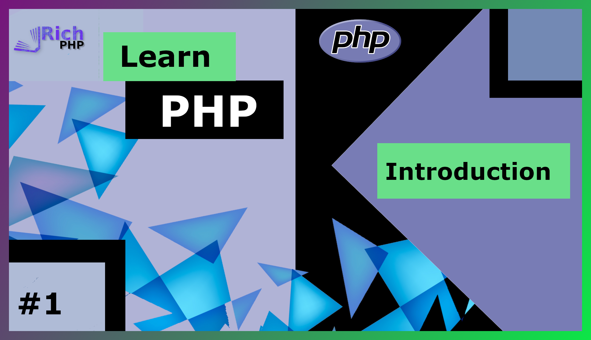
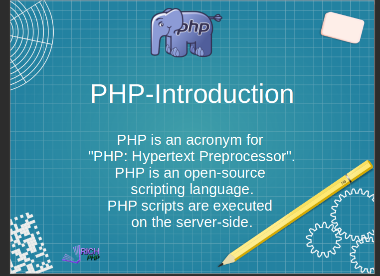
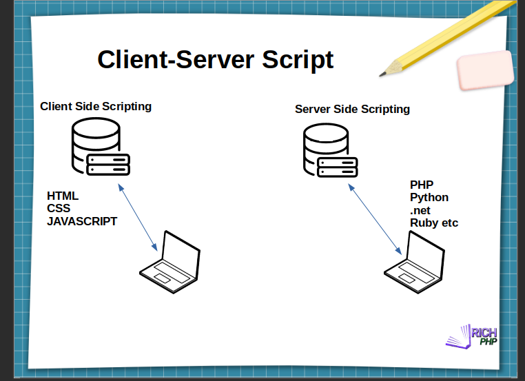
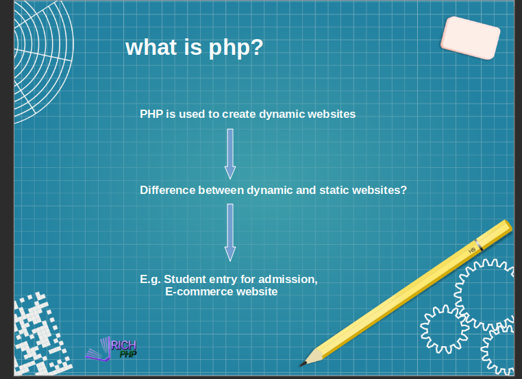
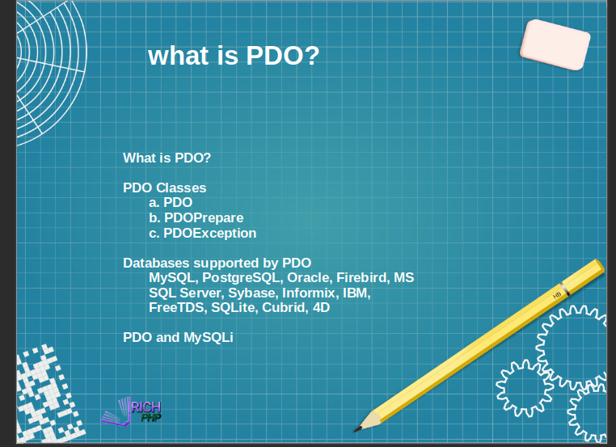
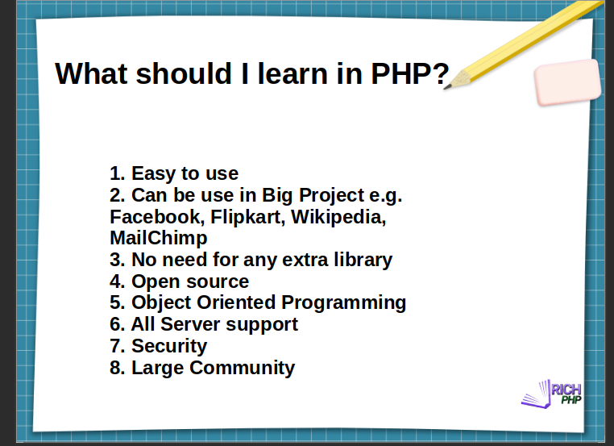
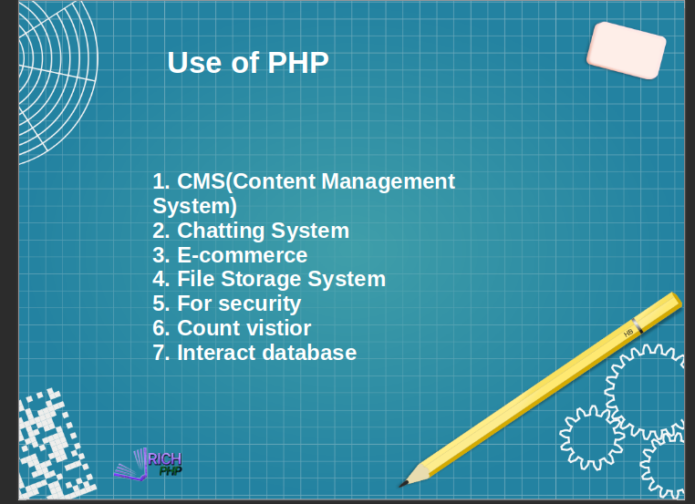
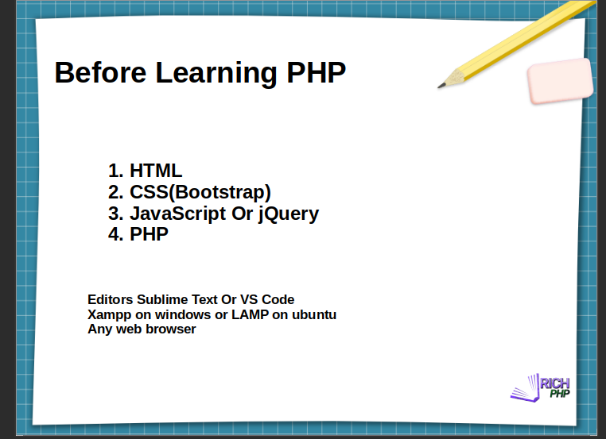

<!DOCTYPE html>
<html>
<head>
<meta http-equiv="Content-Type" content="text/html; charset=UTF-8">
<meta http-equiv="X-UA-Compatible" content="IE=edge">
<meta name="viewport" content="width=device-width,initial-scale=1">
<meta name="description" content="PHP Tutorial 1 - Introduction (PHP For Beginners)">
</head>
<body>

<b>Introduction</b>

Hello Friends, You all are welcome to today's blog.

Today we are going to start a new PHP tutorial on blog. Hope you guys love this tutorial and support us to make more and more blogs. This blog was made for the purpose to teach you about PHP in a simple way.

<h4>Let's start with understanding PHP</h4>
<ul>
<li>PHP stands for Hypertext preprocessor.</li>
<li>what exactly does PHP do?</li>
<li>PHP is an open-source scripting language used to create a dynamic website. PHP Fetch data from a database using MySQL to create a dynamic content-based website. In a programming language, we can call PHP a server-side scripting language.</li>
<li>There are two types of the scripting language used to create dynamic webpages client-side and server-side scripting language.</li>
 

</ul>

<h4>client-side and server-side scripting</h4>
<ul>
<li><b>Client-side scripting</b></li>
<li>So let's learn about what is client-side and server-side scripting. </li>
<li>In client-side scripting when a user opens any URL in the browser that URL sends the request to the server to send data to that user's specific IP Address. After receiving data from the server, the browser process that HTML data and display the final output to the user.</li>
<li>This process is done within a millisecond depending on the user’s internet speed. Also, whatever CSS or JS is used in that website is sent to the browser to display output on the browser tab.</li>
<li><b>Server-side scripting</b></li>
<li>Now, in server-side scripting similarly when the user opens a URL in the browser.</li>
<li>. The browser sent that request to the server. The server start processing that request exactly similar to what client-side scripting does but in server-side scripting server check what programming language is used to create a dynamic website. It uses that programming language to fetch data dynamically then process that data and convert it into HTML and send it back to the browser to display output on the browser tab.  </li>
</ul>

<h4>Let's start with understanding PHP</h4>
<ul>
<li>PHP stands for Hypertext preprocessor.</li>
<li>what exactly does PHP do?</li>
<li>PHP is an open-source scripting language used to create a dynamic website. PHP Fetch data from a database using MySQL to create a dynamic content-based website. In a programming language, we can call PHP a server-side scripting language.</li>
<li>There are two types of the scripting language used to create dynamic webpages client-side and server-side scripting language.</li>
 

 
<li>Here you can say client-side scripting means a static website and server-side scripting means a dynamic website. Hope you guys understand what is client-side and server-side scripting.</li>
</ul>

<h4>How PHP work</h4>
<ul>
<li>Now, we are going to learn about how PHP work to create a dynamic website.</li>
<li>We use PHP to write site logic like calculations or some conditions in code. PHP fetches data from the database using MySQL language and converts it into browser readable format to display final output just like what we learn in server-side scripting. The most important thing is logic how you use your logic is important so develop your logic by practicing daily. You can say that PHP is used for dynamic content management, database management, session tracking, Security on-site, etc.</li>
<li><b>Difference between static and dynamic websites</b></li>
<li>Now, we are going to understand the difference between static and dynamic websites. </li>
<li>A static website means the content of the site never changes until the developer change it. A static site does not have any controller to control static site content it is like a plain HTML, CSS, and JS site that does not have any backend language used in a static site. </li>
<li>On another hand in dynamic site backend language like PHP, python, go or any other backend language is used. It has a control panel to control the content of the website the best example of a dynamic website is amazon, Flipkart e-commerce website. In a dynamic site, you can change the content whenever you want and this is the best part of a dynamic site.</li>

<li><b>Example for a static and dynamic website.</b></li>
<li>Consider if we need to insert 100 student records. In the Static site, every time we need to open code and insert data for new students and that code is only understood by the developer.  Because of limited manpower, it is time-consuming and difficult and also puts press on one person.</li>
<li>In a Dynamic site, the developer creates one control panel for a site that is simple and anyone can learn. So it makes it easy to insert 100 student records easily into the database. Because lots of people can work at the time it makes the process easy and time-saving and also works load gets divided.</li>
 

</ul>

<h4>Understand what is PDO?</h4>
<ul>
<li>Now, Understand what is PDO? This channel mostly we are using PDO and also most framework in PHP uses PDO as a database connecting language. So, for larger or portable projects PDO is preferable. Even the Zend framework use PDO.</li>
<li>PDO stands for PHP data object. PDO is a data access layer that uses a unified API (Application programming interface). PDO divides into two components one is the core which provides an interface and the other is a driver which accesses specific drivers.</li>
</ul>
 
<b>PDO's three main classes are</b>
 
<ol>
<li>PDO - To establish a connection to the database</li>
<li>PDOPrepare - Prepare a statement to execute</li>
<li>PDOException -  handle error in PDO</li>
</ol>
<ul>
<li><b>The advantage of PDO is</b></li>
<li>PDO can access more than 10 databases it can easily transfer from one database to another.</li>
<li>Easy to handle the error.</li>
<li>Easily connect to database</li>
<li>Code reusability and security</li>
<li><b>Difference between PDO and MySQL</b></li>
<li>PDO has 12 different drivers for database connection MySQL has only one MySQL.</li>
<li>The name parameter is available in PDO but not in MySQL</li>
<li>PDO is more secure than MySQL</li>

 
	

</ul>

<h4>Now, why to learn PHP?</h4>
<ul>
<li>PHP has a large community you can easily find any error’s solution online. </li>
<li>PHP syntax is easy to understand. More than 70% of websites build in PHP. Also, PHP is used in Facebook, Flipkart, Wikipedia, and many more sites are built using PHP.</li>
<li>Also, PHP is an open-source language you don't need to buy any license to use PHP in your project.</li>
<li>PHP uses an object-oriented programming approach so code reusability and security are more if compare with another language.</li>
<li>PHP Support all server and also you can decide what type of security you want in your project. </li>
 

 
<li><b>Use of PHP</b></li>
<li>Almost in every application, we can use PHP for example in CMS to manage the content, chatting system, e-commerce, google drive like file system, etc.
</li>
<li>Also, we can use in android application API for better security in API.</li>
 

</ul>

<h4>what do we need before learning PHP?</h4>
<ul>
<li>Basic knowledge of HTML, CSS, and JS don't worry if you do not know this we can learn this thing in future blogs.</li>
<li>Select any code editor like sublime or VS Code im using sublime text because it is a very lightweight code editor that also runs on the old system.</li>
<li>Also, we need to create a local server environment to run PHP code you can install XAMPP, LAMP, or WAMP  server on both Linux and Windows operating systems. Any browser to run code.</li>
 

 

<li>The most important thing in any programming language is logic. work on your logic you can easily switch from one programming language to another programming language.</li> 
<li>Now consider one example if you want to print 1 to 10 numbers on the screen you print using echo, recursive function, or for loop here what you choose is important select echo is a really bad idea to print number if that number increases it so much time to write code to print number. if you choose the other two methods. it is easy to increase the number to print on the screen.</li>
</ul>

<h4>That's it guys hope you guys all understand what we are doing and how that help you in your career.</h4> 
<h4>Thank you, friends.</h4>
<h4>Keep coding and support us to create more videos</h4> 
<h4>Bye-bye</h4>

    
</body>
</html>